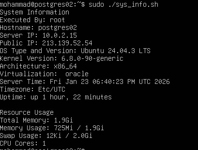
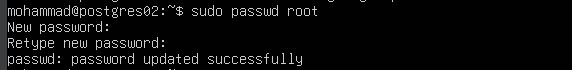
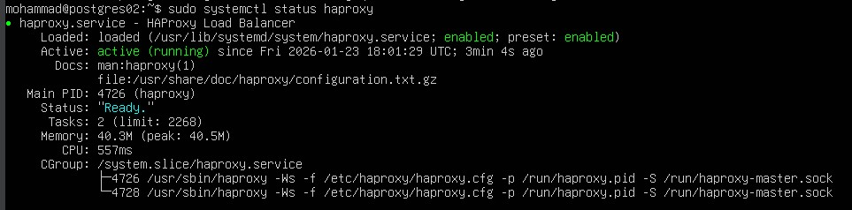
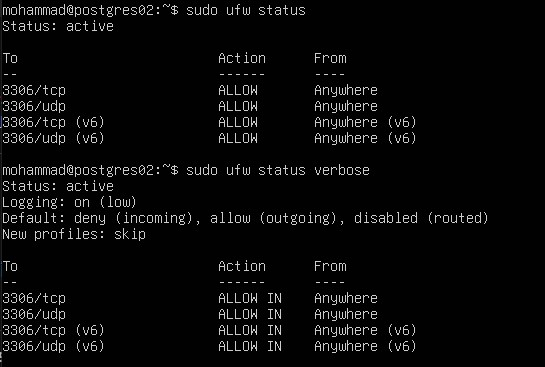
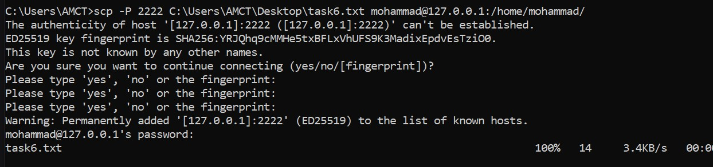

# ProgressSoft Internship Assignment

## Section 1: Linux Administration

### 1. Bash Scripting (Task 1)
I developed a comprehensive Bash script to automate system monitoring. The script extracts real-time data about the server's health and network configuration.

* **Key Features:** Displays Hostname, Server IP, Public IP, OS version, Kernel info, and Resource Usage (Memory/CPU).
* **Source Code:** [Source Code](./Script/sys_info.sh)

**Execution Output:**

---

### 2. User & Group Management (Tasks 2, 3 & 4)
To ensure a secure multi-user environment, I performed the following:
* Created a primary group `PSgroup` and a secondary group `dba`.
* Added a new administrative user `PS` and assigned them to the respective groups.
* Secured the `root` account with a strong password policy.

**Verification (Users & Groups):**
**User Creation Proof:**

---

### 3. Software Installation & Firewall (Task 5)
I prepared the server for database hosting and load balancing by installing `mysql-server` and `haproxy`. 

**Network Security:**
The firewall (UFW) was configured to strictly allow traffic on port **3306** (TCP/UDP) as per the assignment requirements.
* `sudo ufw allow 3306`

---

### 4. Secure File Transfer (Task 6)
I demonstrated the ability to transfer files from a Windows Host to the Linux Guest using the `scp` protocol. 

* **Mechanism:** Since the VM is behind a NAT network, I utilized **Port Forwarding** (Host Port 2222 -> Guest Port 22).
* **Result:** The file `task6.txt` was successfully moved to the `/home/mohammad/` directory.

**Transfer Confirmation (100%):**
**Transfer Confirmation (100%):**

---

### 5. Linux Knowledge Base (Task 7)
Through this task, I explored the Linux File Hierarchy Standard (FHS):
* **Architecture:** Understood the interaction between the Kernel, Shell, and User space.
* **Directories:** Managed configurations in `/etc` and logs in `/var/log`.
* **Distribution:** Used **Ubuntu 24.04 LTS** for its stability and enterprise support.
