# ProgressSoft Internship Assignment
## Introduction
This project focuses on the implementation and management of essential IT tools and technologies required for modern application deployment. The goal is to demonstrate a foundational understanding and practical experience in the following areas:
- Operating Systems: Linux administration and shell scripting.
- Databases: Relational database management using SQL and PL/SQL.
- Application Servers: Configuration and automation of Apache Tomcat.
- Modern Infrastructure: Containerization with Docker and orchestration with Kubernetes.
- Automation: Infrastructure as Code (IaC) using Vagrant and provisioning scripts.

## Environment Setup
 To ensure a consistent and isolated testing environment, the following setup was utilized:
- Virtualization: Oracle VM VirtualBox / VMware.
- Operating System: Ubuntu 22.04.3 LTS .
- Kernel Version: 5.15.0-116-generic.
- Architecture: x86_64.
- Hardware Allocation: 4GB RAM and 2 CPU Core.

 ## Project Sections:

 ---
 
 ## 1. Linux Administration
### System Information Script (Task 1)
The implementation phase began with the establishment of a centralized system monitoring framework. To achieve this, a modular Bash script was developed to automate the extraction of critical system metrics. The methodology focused on capturing real-time data including hostname configurations, network addressing (both internal and public IPs), and OS architecture details. This approach ensures that any system administrator can perform an immediate health check of the server with a single command, streamlining the diagnostic process and reducing human error in resource tracking.
* **Source Code:** [Source Code](./Script/sys_info.sh)

**Execution Output:**

---

### User and Access Management (Tasks 2 & 3 )
Following the initial setup, the methodology shifted toward securing the environment through a structured access control policy. This involved the provisioning of specific administrative groups, `PSgroup` and `dba`, to facilitate role-based access control. A new administrative user, `PS`, was then integrated into these groups, ensuring that all database-related operations are handled by an account with the appropriate permissions. To finalize the hardening process, a rigorous security policy was applied to the root account, enforcing strong authentication standards to protect the system's core integrity from unauthorized access.

**Verification (Users & Groups):**

---

### Service Installation & Network Security (Task 4 & 5)
The next stage of the deployment focused on preparing the server for production-ready services. This involved the orchestrated installation of `mysql-server` for data management and `haproxy` for load balancing capabilities. To protect these services, a "Deny-by-Default" firewall policy was implemented using UFW. The methodology here was to minimize the server's attack surface by explicitly filtering all traffic and only permitting ingress communication on port `3306`, ensuring that database services are accessible only through secured and intended channels.
To install the required database engine and load balancer, the following commands were executed:
* `sudo apt update` 
*  `sudo apt install mysql-server -y`  
* `sudo apt install haproxy -y`

**Network Security:**
The firewall (UFW) was configured to strictly allow traffic on port **3306** (TCP/UDP) as per the assignment requirements.
* `sudo ufw allow 3306/tcp`
* `sudo ufw allow 3306/udp`

---

### File Transfer Protocols (Task 6)
The methodology for transferring data between the Windows host and the Linux environment was designed with a "Security-First" approach. To facilitate the transfer, a temporary communication channel was established using NAT-based `Port Forwarding` (mapping host port 2222 to guest port 22). The firewall policy was temporarily modified to permit SSH traffic on port 22 to allow the `scp` operation. Once the file `task6.txt` was successfully synchronized and verified in the guest's home directory, the port 22 access was immediately revoked using a deny rule to eliminate any potential security vulnerabilities. This practice of dynamic port management demonstrates a commitment to maintaining a minimal attack surface throughout the administrative workflow.

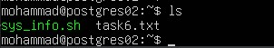

---

## 2. SQL & Relational Databases
### Database Access & Initial Setup
Before executing the schema scripts, I accessed the MySQL environment and prepared the workspace using the following commands:

* Accessing the MySQL CLI: Used the terminal to log in as the root user.
`sudo mysql -u root -p`
* Creating the Project Database: Initialized a dedicated schema for the assignment.
  `CREATE DATABASE progressSoft_ DB;`
* Selecting the Database: Switched the context to the newly created database.
  `USE progressSoft_DB;`

### Database Schema Design Methodology (Q1)

To automate the environment setup, a comprehensive script named `solution.sql` has been provided. This script sequentially handles database creation, schema definition, data population, and the generation of the final analytical report. It can be executed via the Linux terminal using the following command: `mysql -u root -p < solution.sql`

* **Source Code:** [solution.sql](./Script/solution.sql)

The methodology adopted for the database design centered on achieving a high level of Data Normalization while maintaining strict Referential Integrity. To minimize data redundancy, the architecture was decomposed into four interconnected entities: `MyEmployee, MyDepartment, University, and Gender`. The design process involved careful selection of data types to ensure system precision; for instance, the `SALARY` field utilizes `DECIMAL(10, 2)` for financial accuracy, while the `EMP_IMAGE` field was implemented using the `BLOB` (Binary Large Object) type to allow the direct storage of employee portraits as binary data within the database. A unique aspect of this methodology is the implementation of a `Self-Referencing Relationship` via the `MANAGER_USERID` column. This design choice allows the system to represent the organizational hierarchy within a single table by linking an employee’s record to their manager’s `USERID`, thereby ensuring that the reporting structure is maintained through a robust foreign key constraint.

`show tables;`

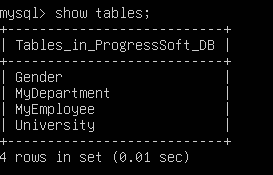

`describe (TableName);`

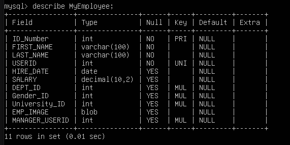

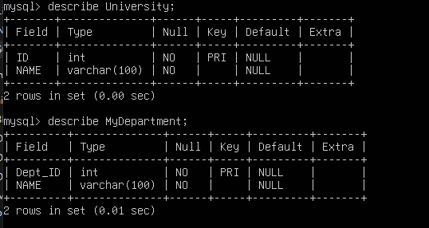

---

### Relational Data Retrieval and Hierarchical Mapping (Q2) 
The primary goal of this phase was to transform the normalized database into a readable report that fulfills the assignment requirements. To achieve this, I followed a structured query approach centered on the use of Table Joins. I utilized `INNER JOINs` to link the main `MyEmployee` table with the `MyDepartment, Gender, and University tables`, ensuring that each record correctly pulls the descriptive names instead of just the ID numbers.

For the organizational hierarchy, I implemented a `Self-Join` by linking the table to itself via the `MANAGER_USERID` field. In this step, I specifically chose a `LEFT JOIN` to ensure data completeness; this allows the report to include all employees, even those at the top of the hierarchy who do not have a supervisor. To improve the final output's presentation, I used the `CONCAT()` function to combine first and last names into a single column. Finally, I applied Table Aliasing (using e, m, d, etc.) to keep the SQL code organized and avoid any errors related to duplicate column names.

---

### Data Manipulation and Maintenance (Q3)

In this task, the methodology focused on enhancing the database schema to support specific reporting requirements. To achieve this, I created a new table named `JobTitles` to store professional designations separately, ensuring the design follows normalization principles. Following the table creation, I linked it to the `MyEmployee` table by adding a `Job_ID` column as a Foreign Key. This relationship allowed me to assign a specific job role to each employee.

The final step involved implementing a query to calculate the total monthly payroll per job title. The logic was designed to exclude "Sales" employees using a WHERE clause and then group the remaining data. By applying a HAVING clause, the system successfully filtered the results to only display job titles where the total salary expenditure exceeds $2500, ensuring accurate and meaningful data retrieval.

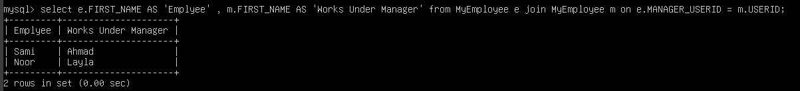

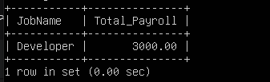

---

### SQL Syntax Debugging & Error Identification (Q4)

* Identified Errors: 
1. Missing Multiplication Operator (*): The multiplication operator `x` should be replaced with `*` for correct syntax.
2. Missing AS for Alias: The alias ANNUAL SALARY needs to be preceded by the `AS` keyword to define the column properly.
3. Incorrect Semicolon Placement: A semicolon `;` was placed before the `FROM` keyword, which is incorrect. It should only appear at the end of the query.
4. Quotation Marks for Alias: The alias ANNUAL SALARY should be enclosed in `double quotes (")` since it contains a space.

* Corrected Query:
`SELECT empno, ename, salary * 12 AS "ANNUAL SALARY" FROM emp;`

---

### Procedural Logic and Function Implementation (Q5)
This task required a comparative analysis of employee seniority based on a specific reference point: the `hire date` of an employee named `SCOTT`. To ensure the solution remains dynamic, I implemented a Subquery within the WHERE clause. This methodology allows the system to first isolate SCOTT's hire date as a variable baseline and then filter the remaining records for any employee hired after that specific date. This approach eliminates the risk of hard-coding errors and demonstrates an advanced understanding of relational logic and relative data filtering.

---
### Automated Data Migration & Procedural PL/SQL (Q6)

This task of the project involved implementing a robust data migration strategy using Oracle PL/SQL. The methodology focused on creating a specialized stored procedure, `P_COPY_EMPLOYEE`, designed to automate the synchronization of records between the primary `MyEmployee` table and a secondary `MyEmployee_update` archive.

The implementation logic follows a strict transactional sequence: first, the destination table is cleared to prevent data duplication; second, a bulk data transfer is performed to maintain structural parity; and finally, a commit operation ensures data persistence. This procedural approach demonstrates an advanced understanding of database automation and the ability to encapsulate complex maintenance tasks into reusable database objects.

---

## 3.Web Server Management (Tomcat)
This project demonstrates the deployment and configuration of a Java-based web environment using Apache Tomcat v9.0.98 and infrastructure automation via Vagrant.

1. JVM (Java Virtual Machine): An engine that provides a runtime environment to drive Java-based applications, acting as a bridge between Java code and the OS.
2. Application Server: A software framework (like Apache Tomcat) that provides an environment to run web applications and manage business logic and database connectivity.
3. WAR File (Web Application Resource): A compressed file format used to distribute a collection of JavaServer Pages, Servlets, and other resources. Tomcat automatically deploys these files when placed in the `webapps` directory.

**Tomcat Configuration (Practice #1 & #2):**
- Installed Apache Tomcat v9.0.98 and successfully initialized the service.
- Reconfigured the service port from 8080 to 7070 by modifying the <Connector> tag in the `server.xml` file.

  `cd ../conf`
`nano server.xml` 
`cd ../bin`
`./startup.sh`
  
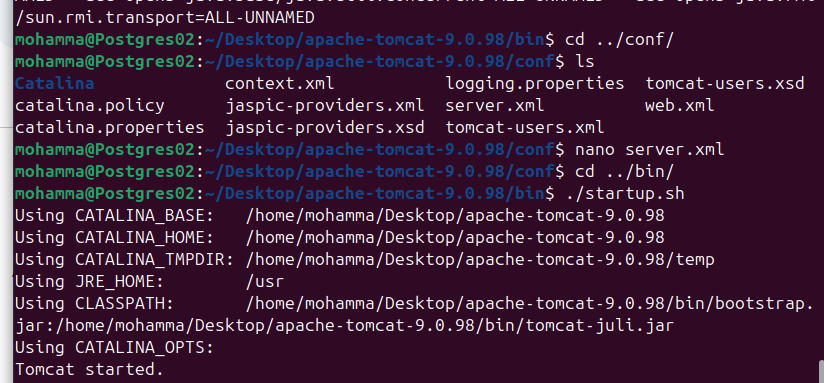
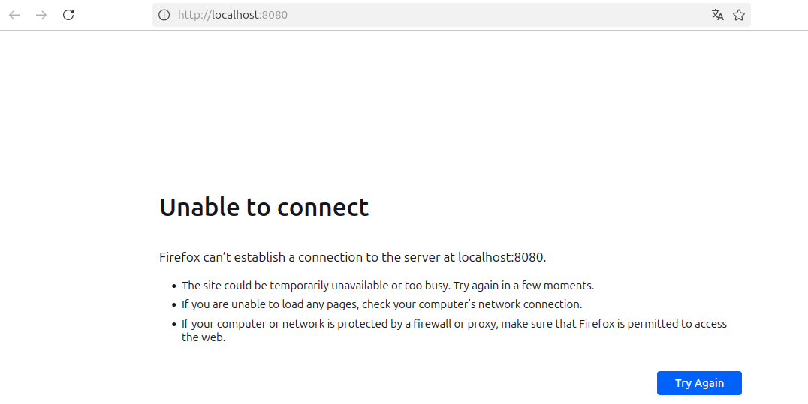
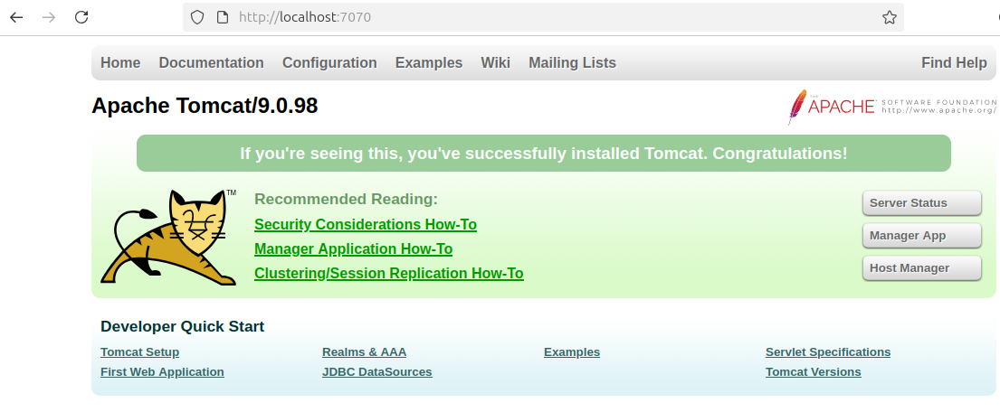

To provide a seamless and professional user experience, an Nginx Reverse Proxy was configured. This setup routes traffic from the standard HTTP port (80) to the internal Tomcat service running on port 7070.

Key Benefits:
- Accessibility: Users can access the WebApp via IP/Domain without manually appending :7070.
- Security: Hides the internal application server details from the public web.
- Scalability: Simplifies the process of adding SSL (HTTPS) or load balancing in the future.

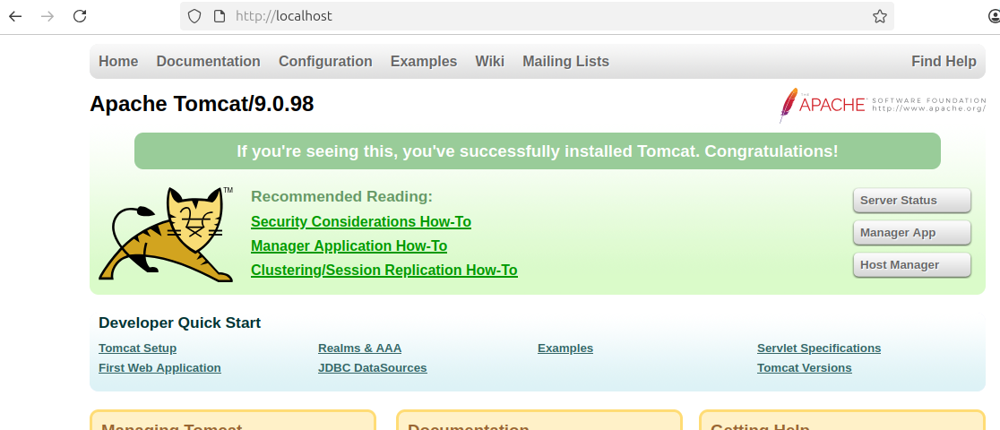

**Infrastructure as Code (Practice #3):**

Instead of manual environment setup, I implemented an automated deployment strategy using Vagrant to ensure environment parity and "one-click" reproducibility.
Virtual Resource Allocation: Configured the virtual machine to use 2GB of RAM and the Ubuntu 24.04 LTS box to provide a stable, production-like environment for the Java application.
Networking & Connectivity: Established a Port Forwarding rule (Host: 9090 → Guest: 7070) to allow external access to the Tomcat service through the host machine's browser.
Automated Provisioning Workflow: Integrated a specialized shell script that executes upon initialization to:
1. Update system packages.
2. Install OpenJDK 8 (as the required Java runtime).
3. Deploy and start Apache Tomcat 9.
4. Configure the server to listen on port 7070 automatically.

* **Source Code:** [Vagrantfile](./Script/Vagrantfile)

Note:
The Vagrantfile was fully developed according to requirements. However, execution was blocked by a `VERR_VMX_NO_VMX` error. This is due to a Nested Virtualization conflict between the Windows 10 host and the Linux environment on this Dell Inspiron 5558. While the hardware supports VT-x, the host OS restricted access, preventing the VM from booting. The Infrastructure as Code (IaC) remains technically valid.

---

## 4. DevOps & Infrastructure (Docker, K8s, Vagrant)
**Docker:**
Step 1: Building the Application Image
The first phase was to create a specialized environment for the Java application. Using a Dockerfile, I built a custom image based on `tomcat:9.0-jdk8-openjdk` .

Automation: The build process automatically handles the deployment by copying the sample.war file into the Tomcat webapps directory.

Success: The image was successfully generated and tagged as `my-tomcat-app:latest` .

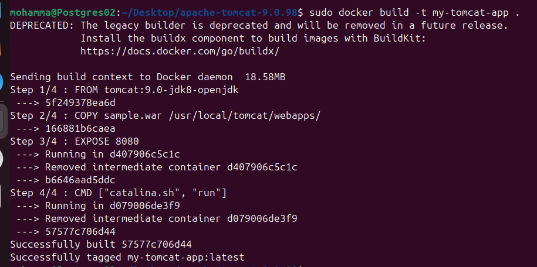

Step 2: Microservices Deployment
After building the application image, I moved to deploying the supporting services using the Docker CLI to ensure a scalable architecture:

Nginx Web Server: Deployed to act as the entry point, mapped to Port 8081 to ensure smooth accessibility.

PostgreSQL Database: Deployed as an isolated database service with secure environment configurations.

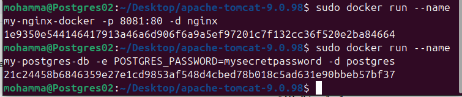

Step 3: Infrastructure Verification
The final phase was to verify that the entire infrastructure is healthy and communicating correctly:

Active Status: Checked that all containers are running in the background without issues.

Port Mapping: Verified that the host machine is correctly forwarding traffic to the containers (e.g., Port 8081 for Nginx and Port 5432 for Postgres).

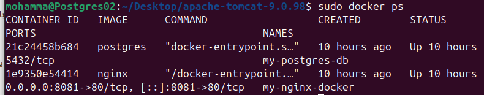

Kubernetes:

